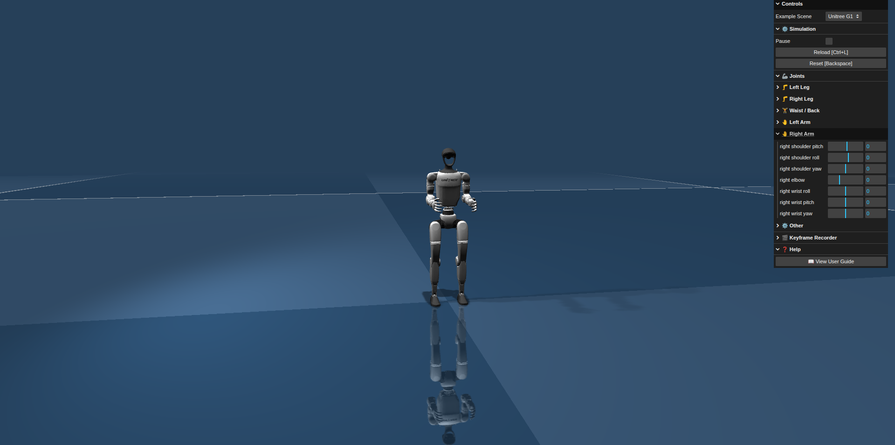

# Unitree Sim Web — Next-Gen Unitree G1 Humanoid Simulation Platform



Welcome to **Unitree Sim Web**, the most advanced browser-based simulation platform for the **Unitree G1** humanoid robot, developed by **STrike Robot**. Built on [MuJoCo WASM](https://github.com/google-deepmind/mujoco/tree/main/dist), this project brings professional-grade physical simulation directly to your browser without the need for complex GPU installations or heavy backend software.

---

## Key Features

*   **High Performance:** Leverages WebAssembly to run MuJoCo physics directly in the browser with ultra-low latency.
*   **Real-time Joint Control:** Intuitive interface for controlling individual joint groups (Limb-based control).
*   **Keyframe Recording:** Record pose sequences, play them back, and export high-quality `.webm` videos.
*   **No Backend GPU Required:** All physics calculations are performed on the client-side for seamless accessibility.
*   **Developer Ready:** Includes built-in user guides and pose-tips for the Unitree G1 model.

---

##  REVEAL: Humanoid Policy Integration

A major breakthrough we are excited to showcase is the platform's support for **Humanoid Policy Integration**. This feature allows researchers and developers to load pre-trained control policies (e.g., from Reinforcement Learning) and observe their performance in a realistic physics environment.

Take a look at the demo video below to see the humanoid policy in action:

<div align="center">

[](https://www.youtube.com/watch?v=xRaUiaI7MTM)

<p><i>Video: Demo of Unitree G1 Humanoid Policy Integration (Click to watch on YouTube)</i></p>
</div>

*This feature bridges the gap between algorithm development and physical experimentation, providing a powerful sandbox for robot control testing.*

---

## Quick Start — Local Development

### Prerequisites

| Tool | Version |
| :--- | :--- |
| **Node.js** | ≥ 18 |
| **Python** | ≥ 3.10 |

###  Installation Steps

Follow these steps to set up and run the simulation locally:

1.  **Install dependencies:**
    ```bash
    npm install
    ```

2.  **Build the frontend bundle:**
    ```bash
    npm run build
    ```

3.  **Start the secure HTTP server:**
    ```bash
    python3 run_server.py
    ```

Once the server is running, open [**http://localhost:8000**](http://localhost:8000) in your browser (Chrome or Edge recommended for optimal performance).

> [!IMPORTANT]
> **Technical Note:** You must use `run_server.py` instead of the standard `python -m http.server`. This server is specifically configured with `CORP` and `COEP` security headers required for SharedArrayBuffer (essential for MuJoCo WASM).

---

## Deploy with Docker (Recommended)

For a consistent and stable environment, we recommend using Docker Compose:

```bash
docker compose up -d
```

The application will be available at port `8000`.

---

## Project Structure

```text
Unitree_Sim_web/
├── src/                # Core logic (Three.js scene, MuJoCo Utils)
├── assets/             # Robot models (XML, STL, Textures)
├── images/             # Media assets (Images and Videos)
├── run_server.py       # Secure HTTP server implementation
├── Dockerfile          # Container configuration
└── start.sh            # Quick startup script
```

---

## Useful Keyboard Shortcuts

| Key | Action |
| :--- | :--- |
| `Space` | Pause / Resume simulation |
| `Backspace` | Reset robot to initial state |
| `Ctrl + L` | Reload the active XML scene |
| `K` | Save Keyframe (during recording session) |

---

Developed with ❤️ by **STrike Robot**. Feel free to explore and share your feedback! 🚀
